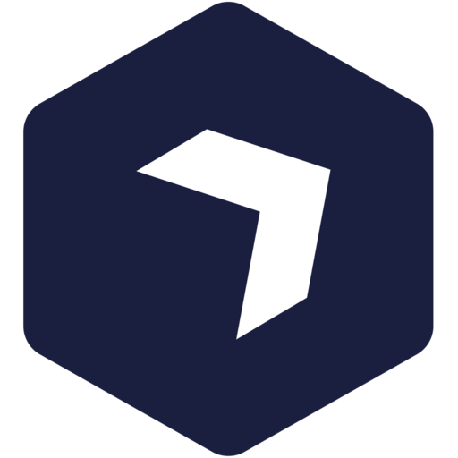

## 주식 가격을 예측하고 점수를 쌓는 커뮤니티

  
  <h3 align="center">Ohddul</h3>
  

    주식가격을 예측고 점수를 쌓는 커뮤니티
     
    <a href="https://ohddul.com"><strong>카카오로 가입하고 주식 가격 예측하기 »</strong></a>
     
     
    상호명 오떨 · 대표명 김현식 · 사업자 등록번호 832-32-01348 · 통신판매 사업자 미등록
  

### 개발정보
1) DB control : File-system
2) Framework : ![Next.js]
3) UserControl : ![NextAuth]
4) Server : ![Ubuntu] ![Nginx]
5) DataSource : OpenDart, Gov.kr, KIS dev

### 수익모델
1) 광고 : 카카오 애드핏, 구글 애드센스
2) 오떨 plus, 오떨 pro 서비스를 통한 차트 수정 (예정)
3) 수익률 상위 유저의 칼럼 작성을 통한 수수료 지급 (예정)

[Next.js]: https://img.shields.io/badge/next.js-000000?style=for-the-badge&logo=nextdotjs&logoColor=white
[NextAuth]: https://img.shields.io/badge/NextAuth-000000?style=for-the-badge&logo=nextdotjs&logoColor=white
[Ubuntu]: https://img.shields.io/badge/ubuntu-000000?style=for-the-badge&logo=ubuntu&logoColor=red
[Nginx]: https://img.shields.io/badge/nginx-000000?style=for-the-badge&logo=nginx&logoColor=green